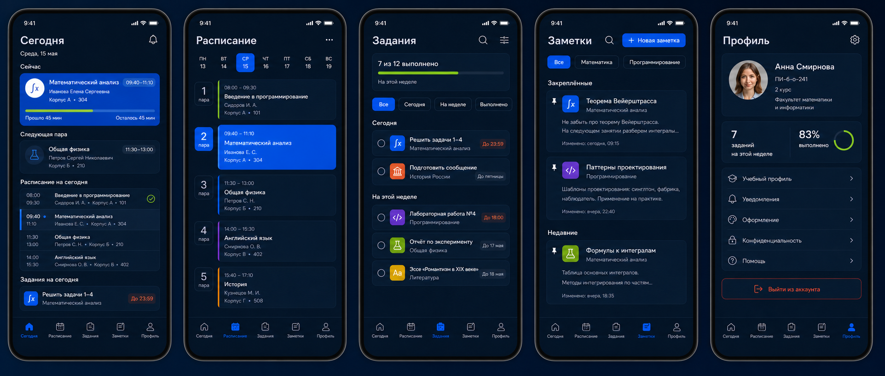
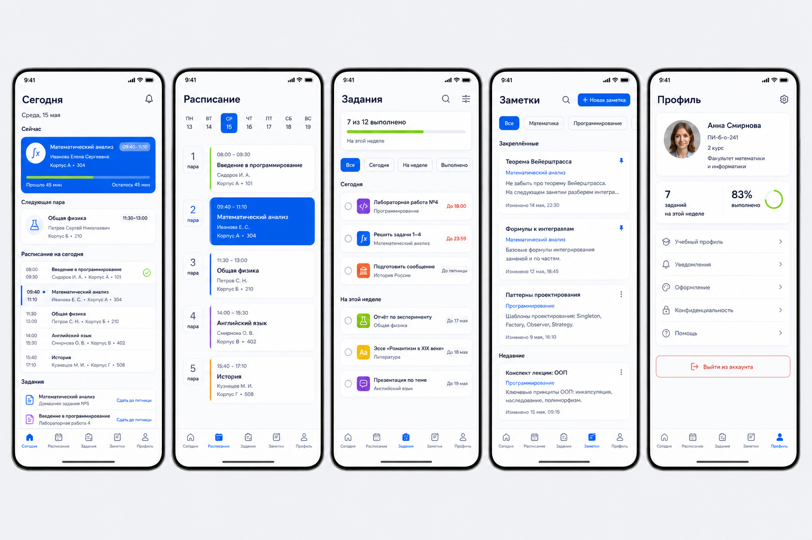
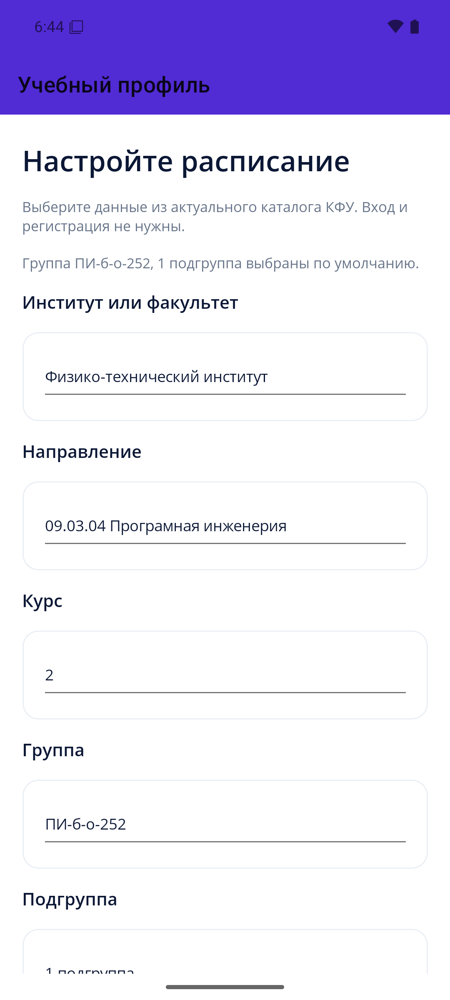
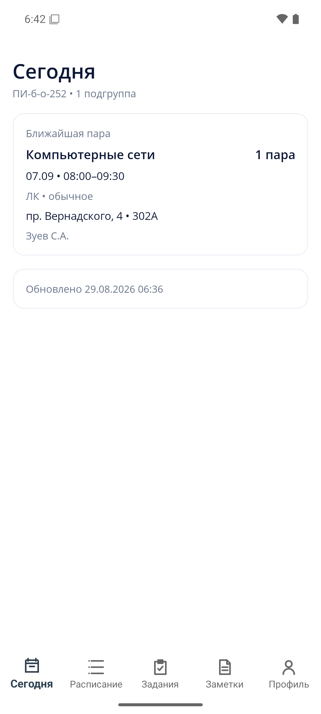
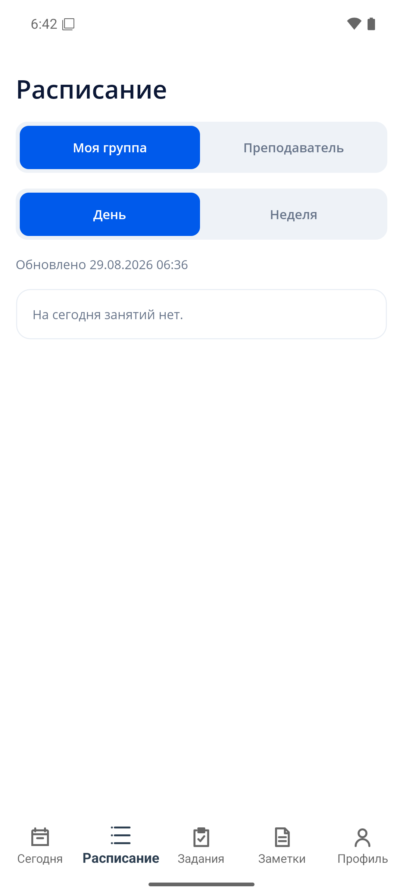
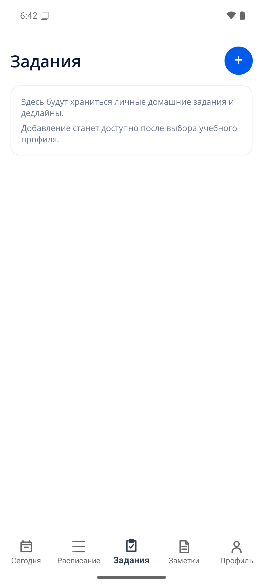
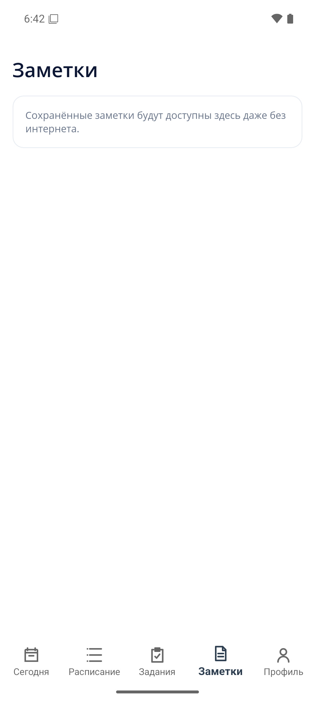
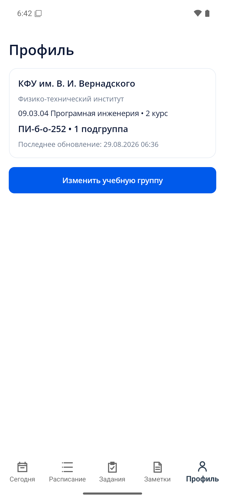

# КФУ ЭлЖур

Мобильное приложение с расписанием и личным электронным дневником для студентов КФУ им. В. И. Вернадского.

Проект разрабатывается на .NET 10: мобильный клиент использует .NET MAUI, SQLite и официальный JSON API КФУ, серверная часть — ASP.NET Core. Вход и регистрация в MVP отсутствуют: при первом запуске пользователь выбирает институт, направление, курс, группу и подгруппу.

## Основные разделы

- **Сегодня** — текущая и следующая пара, расписание дня и ближайшие задания.
- **Расписание** — расписание группы или преподавателя на день и неделю; текущая аудитория преподавателя берётся только из опубликованного занятия.
- **Задания** — домашние задания, дедлайны, материалы и связь с занятием.
- **Заметки** — отдельные сохранённые заметки, привязанные к предметам и занятиям.
- **Профиль** — учебные данные студента, статистика и настройки приложения.

## Дизайн

| Тёмная тема | Светлая тема |
| --- | --- |
|  |  |

## Скриншоты MVP

Скриншоты сняты на Android 16 после первого запуска для группы ПИ-б-о-252, 1 подгруппы.

| Первый запуск | Сегодня | Расписание |
| --- | --- | --- |
|  |  |  |

| Задания | Заметки | Профиль |
| --- | --- | --- |
|  |  |  |

## Структура решения

```text
UniversitySchedule.sln
├── src
│   ├── UniversitySchedule.Domain
│   ├── UniversitySchedule.Application
│   ├── UniversitySchedule.Contracts
│   ├── UniversitySchedule.Infrastructure
│   ├── UniversitySchedule.Api
│   ├── UniversitySchedule.ScheduleImporter
│   ├── UniversitySchedule.Mobile.Core
│   └── UniversitySchedule.Mobile
├── tests
└── docs
```

Архитектурные решения описаны в `docs/architecture`, а исследование источника — в `docs/schedule-source.md`.

## Что уже реализовано

- каркас всех проектов и направленные project references;
- MAUI Shell с пятью согласованными вкладками;
- семантические ресурсы светлой и тёмной тем;
- первый запуск с реальным каталогом институтов, направлений, курсов и групп КФУ;
- загрузка расписания группы из официального API, разворачивание чётных/нечётных недель и фильтрация подгруппы;
- SQLite-кэш каталога, расписаний, поиска преподавателей и выбранного профиля с офлайн-fallback;
- текущая/следующая пара, расписание группы на день/неделю и точный поиск преподавателя с текущей опубликованной аудиторией;
- справочный импорт 13 подразделений, 115 направлений, 423 корректных групп и преподавателей с дополнением данных из Vuzopedia;
- заметки и домашние задания с привязкой к конкретной паре, локальным CRUD, дедлайнами, статусами, закреплением и SQLite-хранилищем;
- навигация расписания по дням и неделям и быстрые действия «добавить заметку/задание» из карточки пары;
- пять вкладок, выровненные с финальными светлой и тёмной дизайн-досками, включая карточки, фильтры, пустые состояния и профильную статистику;
- экран настроек с явными кнопками выхода, системной/светлой/тёмной темами и корректным оформлением системных панелей Android;
- версионированные API-контракты и health endpoint;
- unit-тесты доменной, прикладной и мобильной логики.

## Локальная сборка

Требуются .NET SDK 10 и workload .NET MAUI:

```powershell
dotnet workload install maui
dotnet restore UniversitySchedule.sln
dotnet build UniversitySchedule.sln --no-restore
dotnet test UniversitySchedule.sln --no-build --no-restore
```

Для Android также нужны Android SDK и JDK 21. Локальные пути можно указать в `Directory.Build.local.props`, скопировав `Directory.Build.local.props.example`; локальный файл исключён из Git.

API запускается командой:

```powershell
dotnet run --project src/UniversitySchedule.Api
```

Справочник направлений и преподавателей обновляется командой:

```powershell
dotnet run --project src/UniversitySchedule.ScheduleImporter
```

Отдельный PostgreSQL или Ubuntu-сервер для текущего этапа не требуется: мобильный клиент читает официальный HTTPS API напрямую и работает с локальным SQLite-кэшем. Сервер понадобится на следующих этапах для синхронизации личных заметок между устройствами и резервного импорта.

## Дальнейший план

1. Завершить полный обогащённый снимок преподавателей и регулярно обновлять отчёт покрытия расписания.
2. Добавить локальную очередь синхронизации, серверный API, PostgreSQL и установочную идентичность без экрана входа.
3. Реализовать уведомления, провести расширенные accessibility/UI-тесты на Android и iOS и подготовить release-сборки.
